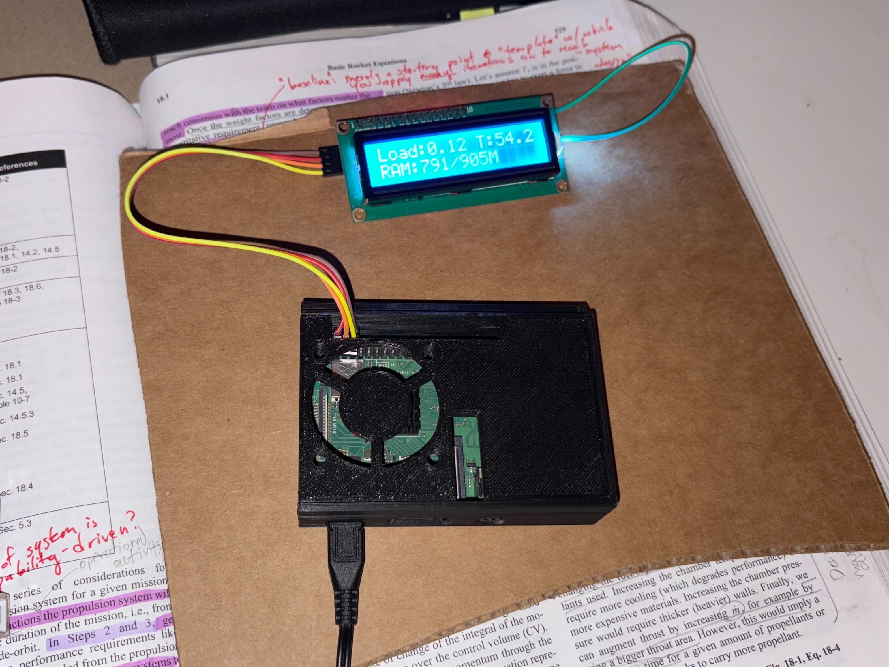

## [002 Introducing myself & the server]
**Date:** 02/26/2026

I'm still figuring out how to use HTML, CSS, and JS. I think it's a good opportunity for me to introduce myself while I continue to iron out the kinks with CSS and this blog page. My name is Eugene Choi, and at the time of posting this I am 24 years old. I will turn 25 in exactly a month from now and experience the impending quarter-life crisis. Never enjoyed tennis, so I reckon pickleball won't be on my to-do list anytime soon. Rock climbing hurts my forearms a bunch and I feel safer when both of my feet are planted on solid ground. 

I've been born and raised here in the heart of Los Angeles, specifically Torrance/Carson. My dream growing up has been to become an astronaut. I think my first few space memories includes visiting NASA's Jet Propulsion Laboratory. I remember there was some kind of exhibit or open house inviting folks from all over to visit JPL. I remember being in a dark room watching <a href:"https://www.youtube.com/watch?v=kSbAUtyO7xo">a bunch of airbags bouncing across the Martian terrain</a>. It feels so surreal being able to dig up old videos that still exist today that fill up the deepest crevices of our childhood memories. I remember my mom buying me a miniature plastic Solar System toy that shows all recognized planets at the time (yes, including Pluto) that I used to have sit in my room. Space always fascinated me as a kid, though frankly I think my passion was nurtured from mostly observing space-related stuff without direct engagement with the material. 

At some point in either 5th or 6th grade, I became convinced that being an astronaut was no longer a possibility. No more Space Shuttles were being rolled out to the launch pad, and talks of anyone becoming an astronaut seemed to be shelved into obscurity. It seemed for me at the time that space was put on pause by the entire world after the ISS. I distinctly remember coming across the fact that US astronauts were only able to access space via the Russian spacecraft Soyuz. I think I was discouraged by that and thought my dreams of becoming an astronaut were outdated. I then started wondering what I should do instead.

Around 7th grade, my Project Lead The Way (PLTW) Gateway teacher gave our class a presentation about a wide variety of engineering fields avaialble in the industry. Our classroom was in a portable classroom (i.e. bungalow). I remember sitting in the middle row of the classroom while our teacher, Mr. Rothman, gave us this presentation. The very first engineering profession Mr. Rothman shared was Aerospace Engineering. He didn't even that far into explaining what this engineering discipline was before I mentally made the decision, "yup, this is what I want to do." No fanfare, nothing insane or dramatic. The way how the next 11 years since then was decided by a rather simple decision. 

To be honest, I'm not entirely sure <i>why</i> engineering enticed me as a middle schooler. My parents didn't have engineering backgrounds and I didn't have engineering role models to look up to in my personal life. My father has gone through several jobs, mostly business/salesman positions. My mother grew up playing classical piano and had plans to attend Julliard. Unfortunately, she experienced a terrible car accident in a parking lot of the building that held her Julliard audition. My parents immigrated from South Korea when they were young (my mother was 15 yrs old when she immigrated with her parents to California). I loved to play with LEGOs, model trains, the Nintendo DS Lite, Minecraft, and the Wii. I didn't tinker with electronics lying around in the garage, write code, or build model planes or rockets like how other folks my age did in their childhood. 

Comparing myself today with my peers who are doing quite well in the industry, I feel like I grew up in SoCal just as an "ordinary kid"; I didn't have really anything in my childhood that was obviously indicating that I was going to have the chops to become an engineer. I think the main thought I had entering middle school (Madrona Middle School) was that I just liked "creating things". In 7th grade, I started a Minecraft Youtube channel with a friend at the time to make videos as part of a collaboration. I had also tried to start a Minecraft comic series with two other friends. In 8th grade, I created a newspaper/journalism club, much in thanks to the support of my English teacher at the time: Mr. Snow. Apparently that writing club is still active and ongoing to this day. Around this time, I also picked up the classical guitar, complementing my music background. I started playing the classical violin since I was around 7yrs old and played pretty consistently right until I started studying at USC for astronautical engineering. From middle to high school, my main exposure to engineering has been my classes. 

Unlike other high schools that offered competitive robotics teams like FTC or FRC, my high school (Torrance High, c/o 2019) didn't have much to offer. Our PLTW classes offered VEX hardware as part of the PLTW curriculum, which was great in its own right. I entered an online PLTW design competition with a classmate as a junior in high school, which gave me an opportunity to create my own engineering portfolio. It wasn't anything remarkable on its own, but it's definitely a fond memory of mine that's somewhat related to engineering. 

I'll put a pause on the Eugene lore for a sec and talk about the setup I'm using to run this website. I'm using a Raspberry Pi 3B+ that I bought during the pandemic, running Nginx and Tailgate to run my website and to connect to the Pi from virtually anywhere via mesh tunneling, respectively. See below for a pic of my sexy server setup. 

I'm currently taking a web dev class that covers the holy trinity of front-end (HTML, CSS, JS) and PHP as the back-end. Honestly, taking this class is one of the factors encouraging me to create this website. I've always been fascinated about web/web app development but never could find it in myself to self-learn everything at home. I recently got laid off from my contractor gig at Skyryse, an aerospace startup in El Segundo, and am looking for work. I also am still in progress of completing my bachelor's degree (why I haven't gotten it yet despite starting my bachelor's back in 2020 is a story for a later blog) as well, so it's not exactly easy to get an engineering job despite all my accumulated work experiences. Building this website is for me an outlet for embracing a unique technical challenge and growing my skillsets. 

Even if this project doesn't blow up in the future, I want to be the kind of person that can create anything that he wants so long as I have a good product roadmap and business strategy. Nothing's stopping me from becoming more technically savant on my own. Making a great business is a different ballpark altogether. When that good idea (hopefully) arrives in my mind, I don't want to be caught with my pants down not knowing how execute said-good idea. 

Gonna wrap up my thoughts here. Not intending to post daily here, but I do like the idea of dumping my thoughts and history somewhere other than my mind every now and then. Learning how to work with Markdown files is a good skill to acquire along the way as well. 